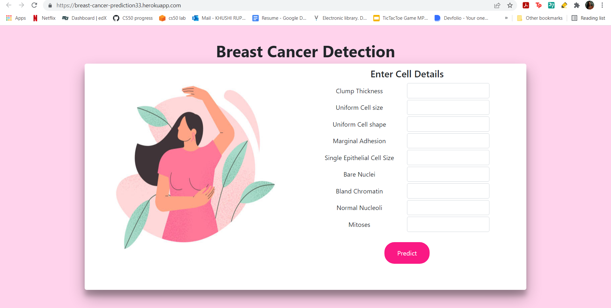

# Breast-Cancer-Prediction
## Introduction
Research indicates that most experienced physicians can diagnose cancer with 79 percent accuracy while 91 percent correct diagnosis is achieved using machine learning techniques.
Breast cancer is the most common cancer amongst women in the world. It accounts for 25% of all cancer cases, and affected over 2.1 Million people in 2015 alone. It starts when cells in the breast begin to grow out of control. These cells usually form tumors that can be seen via X-ray or felt as lumps in the breast area.
The key challenges against it’s detection is how to classify tumors into malignant (cancerous) or benign(non cancerous). 

## Dataset
https://www.kaggle.com/uciml/breast-cancer-wisconsin-data

## Objective
* To Understand the Dataset & cleanup (if required).
* To Build classification models to predict whether the cancer type is Malignant or Benign.
* To fine-tune the hyperparameters & compare the evaluation metrics of various classification algorithms.

## Check out our project
Link: https://breast-cancer-prediction33.herokuapp.com/

## The Application

